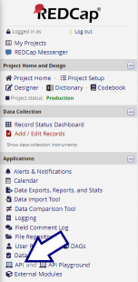

## How to use `REDCapInterface` class to connect with REDCap API

You will need to generate a token for yourself in the CAPMC project in REDCap. Click _API_ in the REDCap menu:

Copy the file `config-example.key` to `F:\RedCap\secrets\config.key`. Put your token into `config.key` and save the file.

### CREATE
To create a new record, instantiate an object of the `REDCapInterface` class and call its `create` method, supplying a `dict` or `pandas.DataFrame` object:

    from REDCap_API_interface import REDCapInterface

    redcap_interface_object = REDCapInterface()
    new_data = {'study_id': '12345', 'name': "Patient's Name", 'mrn': 000000, ...}
    redcap_interface_object.create(new_data)

### RETRIEVE
To retrieve _all_ records, instantiate an object of the `REDCapInterface` class and call its `retrieve` method with no records specified:

    from REDCap_API_interface import REDCapInterface

    redcap_interface_object = REDCapInterface()
    df = redcap_interface_object.retrieve()

To retrieve selected records, specify a list of record numbers:

    df = redcap_interface_object.retrieve([20, 22])

Or to retrieve just one record by record number:

    df = redcap_interface_object.retrieve(42)
### UPDATE
To update an existing record, instantiate an object of the `REDCapInterface` class and call its `update` method, supplying a `dict` or `pandas.DataFrame` object containing the `study_id` of the record to be modified, along with any updated fields.:

    from REDCap_API_interface import REDCapInterface

    redcap_interface_object = REDCapInterface()
    new_info = {'study_id': str(record_number_to_update),
                'date_of_last_activity': right_now}
    redcap_interface_object.update(new_info)
### DELETE
Use the `delete` method of the `REDCapInterface` class, specifying the record number (`study_id`) of the record to be deleted:

    from REDCap_API_interface import REDCapInterface

    redcap_interface_object = REDCapInterface()
    redcap_interface_object.delete(record_number_to_delete)
### HELPER FUNCTIONS
To determine whether a specific record is present in the database, use the `exists()` method:

    from REDCap_API_interface import REDCapInterface

    redcap_interface_object = REDCapInterface()

    if redcap_interface_object.exists(record_number): ...

To assist in creating a new record, look up the next available record number using the `next_record_number` method:

    from REDCap_API_interface import REDCapInterface

    redcap_interface_object = REDCapInterface()
    new_record_number = redcap_interface_object.next_record_number()

This `new_record_number` is guaranteed _not_ to exist. The highest record number that _does_ exist is found with the `last_record_number` method:

    from REDCap_API_interface import REDCapInterface

    redcap_interface_object = REDCapInterface()
    highest_record_number_in_use = redcap_interface_object.last_record_number()

To check what software version is used in the REDCapAPI, use the `version` method:

    from REDCap_API_interface import REDCapInterface

    redcap_interface_object = REDCapInterface()
    print(f"Version = {redcap_interface_object.version()}")
